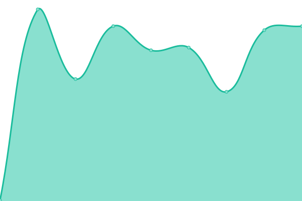
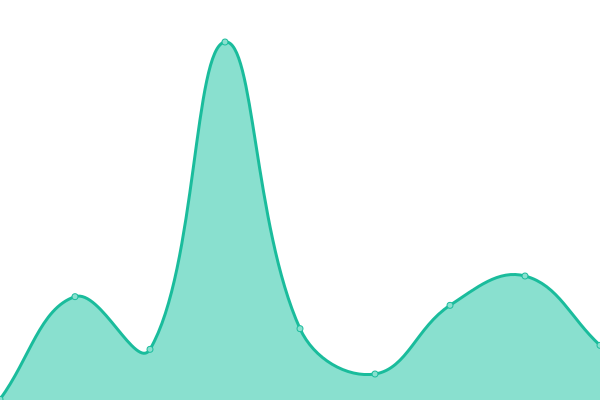

# [📈 Live Status](https://status.zanshin.tenchisecurity.com): <!--live status--> **🟩 All systems operational**

This repository contains the open-source uptime monitor and status page for [Tenchi Security](https://www.tenchisecurity.com), powered by [Upptime](https://github.com/upptime/upptime).

With [Upptime](https://upptime.js.org), you can get your own unlimited and free uptime monitor and status page, powered entirely by a GitHub repository. We use [Issues](https://github.com/tenchi-security/zanshin_status/issues) as incident reports, [Actions](https://github.com/tenchi-security/zanshin_status/actions) as uptime monitors, and [Pages](https://status.zanshin.tenchisecurity.com) for the status page.

<!--start: status pages-->
<!-- This summary is generated by Upptime (https://github.com/upptime/upptime) -->
<!-- Do not edit this manually, your changes will be overwritten -->
<!-- prettier-ignore -->
| URL | Status | History | Response Time | Uptime |
| --- | ------ | ------- | ------------- | ------ |
|  [Zanshin Portal](https://zanshin.tenchisecurity.com) | 🟩 Up | [zanshin-portal.yml](https://github.com/tenchi-security/zanshin_status/commits/HEAD/history/zanshin-portal.yml) | 

 540ms
     
 | 

<a href="https://status.zanshin.tenchisecurity.com/history/zanshin-portal">100.00%</a>
    

|  [Zanshin API health check](https://api.zanshin.tenchisecurity.com/ping) | 🟩 Up | [zanshin-api-health-check.yml](https://github.com/tenchi-security/zanshin_status/commits/HEAD/history/zanshin-api-health-check.yml) | 

 137ms
     
 | 

<a href="https://status.zanshin.tenchisecurity.com/history/zanshin-api-health-check">100.00%</a>
    

|  [Zanshin API user check](https://api.zanshin.tenchisecurity.com/me) | 🟩 Up | [zanshin-api-user-check.yml](https://github.com/tenchi-security/zanshin_status/commits/HEAD/history/zanshin-api-user-check.yml) | 

 377ms
     
 | 

<a href="https://status.zanshin.tenchisecurity.com/history/zanshin-api-user-check">99.93%</a>
    

|  [Zanshin API alert check](https://api.zanshin.tenchisecurity.com/alerts) | 🟩 Up | [zanshin-api-alert-check.yml](https://github.com/tenchi-security/zanshin_status/commits/HEAD/history/zanshin-api-alert-check.yml) | 

 650ms
     
 | 

<a href="https://status.zanshin.tenchisecurity.com/history/zanshin-api-alert-check">100.00%</a>
    

<!--end: status pages-->

[**Visit our status website →**](https://status.zanshin.tenchisecurity.com)

## 📄 License

- Powered by: [Upptime](https://github.com/upptime/upptime)
- Code: [MIT](./LICENSE) © [Tenchi Security](https://www.tenchisecurity.com)
- Data in the `./history` directory: [Open Database License](https://opendatacommons.org/licenses/odbl/1-0/)
